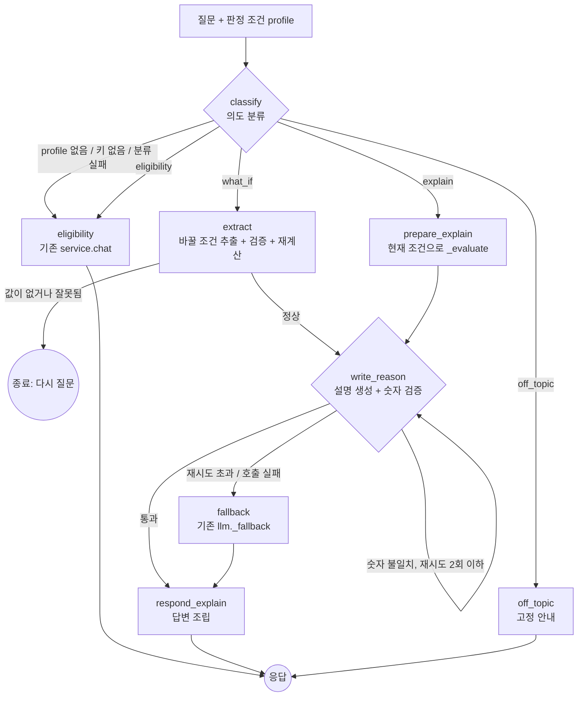

# LangGraph 챗봇 추가 가이드

환경이 챗봇에 LangGraph를 붙여, 판정 결과 화면에서 **판정 설명**과 **조건 변경("3년만 타면?")** 질문까지 답하게 만드는 작업 안내서입니다.

- 기준 커밋: `d973529` (테스트 기준값을 2026-09-18 데이터로 갱신)
- 예상 작업 시간: 패치 적용 10분 / 직접 수정 40분 + 실제 API 키 테스트 30분
- 결과: 백엔드 테스트 189개 통과 (기존 178 + 신규 11), 프론트엔드 `tsc`·`lint` 통과

---

## 1. 무엇이 달라지나요

| 상황 | 지금 | 추가 후 |
|---|---|---|
| 판정 전 (입력 화면) | 보조금 자격·충전소 문의 | **그대로** |
| 판정 후 "우리 지역 충전소는?" | 보조금 자격·충전소 문의 | **그대로** (충전 인프라 근거 유지) |
| 판정 후 "왜 이런 판정이 나왔어요?" | 자료에 없다고 답함 | 판정 사유와 계산값으로 설명 |
| 판정 후 "3년만 타면요?" | 자료에 없다고 답함 | 조건을 바꿔 재계산하고 **화면의 신호등도 갱신** |
| 판정 후 "점심 뭐 먹지?" | 자료에 없다고 답함 | 고정 안내 문구 |
| API 키 없음 / LLM 오류 | "일시적으로 답변할 수 없습니다." | **그대로** |

## 2. 지켜야 할 원칙 (README "판정은 코드, 설명은 LLM")

LangGraph를 붙여도 아래 원칙은 바뀌지 않습니다. 코드를 고칠 때 이 원칙을 깨지 않았는지 확인하세요.

- **등급·계산은 코드가 정합니다.** 조건 변경도 LLM은 "무엇을 바꿀지"만 뽑고, 계산은 `service._evaluate()`가 합니다.
- **바뀐 값은 `EvaluateInput`으로 검증합니다.** 보유 기간 10년처럼 선택지(3/5/7)에 없는 값은 계산하지 않고 다시 묻습니다.
- **LLM이 입력에 없는 숫자를 쓰면 쓰지 않습니다.** 기존에는 바로 폴백했고, 이제는 틀린 숫자를 알려주고 최대 2번 다시 생성한 뒤 그래도 틀리면 폴백합니다.
- **안전 템플릿은 기존 `llm._fallback()`을 그대로 씁니다.** 등급별 고정 문구 + 규칙 사유로만 만들어 틀릴 수 없는 답변입니다.
- **기존 기능은 노드로 재사용합니다.** 자격·충전소 문의는 `service.chat()`, 계산은 `service._evaluate()`/`service.evaluate()`를 부릅니다. 기존 함수는 수정하지 않습니다.

## 3. 그래프 구조



| 노드 | LLM 사용 | 하는 일 |
|---|---|---|
| `classify` | O | `eligibility` / `explain` / `what_if` / `off_topic` 분류. profile이 없으면 LLM을 부르지 않고 `eligibility` |
| `eligibility` | O (기존) | 기존 `service.chat()` 호출. 공통 규정·지자체 공지·충전 인프라 근거 그대로 |
| `prepare_explain` | X | 현재 조건으로 `_evaluate()` |
| `extract` | O | 바꿀 조건 추출 → `EvaluateInput` 검증 → 변경 전·후 `evaluate()` |
| `write_reason` | O | `llm.draft_reason()`으로 설명 1회 생성, 허용되지 않은 숫자 목록 반환 |
| `fallback` | X | `llm._fallback()` |
| `respond_explain` | X | 조건 변경이면 "등급 변화·절감액·회수 기간" 요약 문장을 코드로 만들어 앞에 붙임 |
| `off_topic` | X | 고정 문구 |

## 4. 변경 파일 한눈에 보기

| 파일 | 구분 | 내용 |
|---|---|---|
| `api/chat_graph.py` | **새 파일** | 그래프 본체 |
| `tests/test_chat_graph.py` | **새 파일** | 분기·재시도·폴백·충전소 근거 테스트 11개 |
| `src/llm.py` | 맨 아래 추가 | `classify_intent`, `extract_changes`, `draft_reason` 및 프롬프트 |
| `api/main.py` | 3줄 수정 | `/chat`이 그래프 실행 |
| `requirements.txt` | 1줄 추가 | `langgraph>=1.0.0` |
| `web/lib/api.ts` | 수정 | `chat()`이 `profile`을 보내고 `profile_changes`를 받음 |
| `web/components/ChatWidget.tsx` | 수정 | `profile`·`onApplyChanges` props, 결과 화면 예시 질문 2개 |
| `web/components/EvSignalApp.tsx` | 수정 | 챗봇이 바꾼 조건으로 `run()` 재실행 |

API 변경 요약: `POST /chat` 요청에 `profile`(선택, `/evaluate`와 같은 형식)이 추가되고, 응답에 `profile_changes`(조건을 바꿨을 때만)가 추가됩니다. `profile`을 보내지 않으면 요청·응답 모두 기존과 똑같습니다.

---

## 5. 적용 방법 A — 패치 파일 (권장)

`docs/langgraph-chat.patch`를 레포 루트 기준으로 적용합니다.

```bash
git checkout main && git pull
git checkout -b feature/langgraph-chat

git apply --check docs/langgraph-chat.patch   # 먼저 적용 가능한지 확인
git apply docs/langgraph-chat.patch

pip install -r requirements.txt
pytest                                        # 189 passed 확인
cd web && npm run lint && npx tsc --noEmit
```

`git apply --check`에서 실패하면 기준 커밋 이후 같은 파일이 또 바뀐 것입니다. `git apply --3way docs/langgraph-chat.patch`를 시도하고, 그래도 충돌하면 아래 방법 B로 해당 파일만 직접 고치세요.

## 6. 적용 방법 B — 직접 수정

### 6.1 `requirements.txt`

맨 아래에 한 줄 추가합니다.

```text
langgraph>=1.0.0
```

### 6.2 `src/llm.py` — 맨 아래에 추가

기존 코드는 건드리지 않고 파일 끝에 붙입니다. 기존의 `_complete`, `_api_key`, `_log_failure`, `_build_user_message`, `_parse`, `_numbers`, `SYSTEM_PROMPT`, `HEADLINES`, `CODE_FENCE_RE`를 재사용합니다.

```python
# --- LangGraph 챗봇용 -------------------------------------------------------
# api/chat_graph.py의 노드가 호출한다. 판정·계산은 여전히 코드가 하고, 여기서는
# (1) 질문 의도 분류, (2) 조건 변경값 추출, (3) 판정 설명 초안 1회 생성만 한다.

INTENTS = ("eligibility", "explain", "what_if", "off_topic")

INTENT_SYSTEM_PROMPT = """사용자는 전기차 전환 판정 결과를 이미 받은 상태입니다.
질문을 아래 중 하나로 분류하세요.

- eligibility: 보조금 자격·우대 대상·신청 절차·서류·지자체 공지·지역 충전소 현황에 대한 질문
- explain: 지금 받은 판정 결과(등급, 절감액, 회수 기간 등)의 이유를 묻는 질문
- what_if: 주행거리, 출퇴근 거리, 장거리 빈도, 충전기, 보유 기간, 차량 가격, 비교 내연기관차 연비, 폐차 여부를 바꿔 보는 질문
- off_topic: 전기차 전환·보조금과 무관한 질문

출력은 JSON만. {"intent": "..."}"""

CHANGE_SYSTEM_PROMPT = """사용자 질문에서 '바꿔 보고 싶은 조건'만 뽑아 JSON으로 출력하세요.
질문에 없는 항목은 넣지 마세요. 값을 추정하거나 계산하지 마세요.

사용할 수 있는 키:
- annual_km: 연간 주행거리 (정수, km). "2만km" → 20000
- commute_km: 출퇴근 왕복 거리 (km)
- long_trip: "거의없음" | "월1~2회" | "월3회이상"
- home_charger: 주거지 충전기 있음 (true/false)
- work_charger: "있음" | "없음" | "해당없음"
- hold_years: 보유 기간 (3 | 5 | 7)
- current_efficiency: 비교 내연기관차 연비 (km/L)
- ev_price_manwon: 전기차 가격 (만원, 정수)
- ice_price_manwon: 비교 내연기관차 가격 (만원, 정수)
- has_scrap: 현재 차량 폐차·매도 예정 (true/false)

출력은 JSON만. 예: {"changes": {"annual_km": 20000}}"""

CHANGE_KEYS = {
    "annual_km", "commute_km", "long_trip", "home_charger", "work_charger",
    "hold_years", "current_efficiency", "ev_price_manwon", "ice_price_manwon", "has_scrap",
}


def _json(text: str) -> dict:
    data = json.loads(CODE_FENCE_RE.sub("", text.strip()))
    if not isinstance(data, dict):
        raise ValueError("JSON 객체가 아닙니다")
    return data


def classify_intent(question: str, history: list[dict]) -> str | None:
    """질문 의도. 키 없음·실패 시 None (호출부가 기존 자격 문의로 처리)."""
    api_key = _api_key()
    if not api_key:
        return None
    recent = "\n".join(f"{m['role']}: {m['content']}" for m in history[-4:])
    user_message = f"[최근 대화]\n{recent or '(없음)'}\n\n[질문]\n{question}"
    try:
        intent = _json(_complete(api_key, INTENT_SYSTEM_PROMPT, user_message, max_tokens=50)).get("intent")
    except Exception as e:
        _log_failure("의도 분류 실패", e)
        return None
    return intent if intent in INTENTS else None


def extract_changes(question: str) -> dict | None:
    """바꿔 볼 조건. 허용 키만 남긴다. 실패 시 None, 찾은 게 없으면 {}."""
    api_key = _api_key()
    if not api_key:
        return None
    try:
        changes = _json(_complete(api_key, CHANGE_SYSTEM_PROMPT, question, max_tokens=200)).get("changes")
    except Exception as e:
        _log_failure("조건 추출 실패", e)
        return None
    if not isinstance(changes, dict):
        return {}
    return {k: v for k, v in changes.items() if k in CHANGE_KEYS}


def draft_reason(grade, reasons, ctx, calc_results, feedback: str = "") -> dict:
    """판정 설명을 한 번만 생성하고 검증 결과를 함께 돌려준다 (폴백으로 바꾸지 않음).

    재시도 여부는 그래프가 결정한다. feedback은 이전 시도에서 걸린 숫자 안내다.
    반환: {"result": dict | None, "unknown": list[str], "error": bool}
    """
    api_key = _api_key()
    if not api_key:
        return {"result": None, "unknown": [], "error": True}
    base_message = _build_user_message(grade, reasons, ctx, calc_results)
    # 허용 숫자는 피드백을 붙이기 전의 입력에서만 뽑는다 (피드백 속 틀린 숫자가 허용되지 않도록)
    allowed = _numbers(base_message)
    message = base_message
    if feedback:
        message += f"\n\n[이전 답변의 문제 — 반드시 고치세요]\n{feedback}"
    try:
        parsed = _parse(_complete(api_key, SYSTEM_PROMPT, message))
    except Exception as e:
        _log_failure("설명 초안 실패", e)
        return {"result": None, "unknown": [], "error": True}

    caution = parsed["caution"] if reasons else ""
    unknown = sorted(_numbers(parsed["reason"] + " " + caution) - allowed)
    result = {"headline": HEADLINES.get(grade, ""), "reason": parsed["reason"], "caution": caution, "fallback": False}
    return {"result": result, "unknown": unknown, "error": False}
```

> `draft_reason()`에서 허용 숫자는 **피드백을 붙이기 전** 메시지에서만 뽑습니다. 피드백에는 LLM이 틀리게 쓴 숫자가 들어가므로, 붙인 뒤에 뽑으면 틀린 숫자가 허용 목록에 들어가 검증이 무력화됩니다.

### 6.3 `api/chat_graph.py` — 새 파일

```python
"""LangGraph 챗봇 흐름.

질문 → 의도 분류 → (자격 문의 | 판정 설명 | 조건 변경 | 주제 이탈) → 응답

- 등급·계산은 여전히 코드(service._evaluate, judge)가 정한다.
- 자격·충전소 문의는 기존 service.chat()(→ llm.answer_eligibility)을 그대로 쓴다.
- 판정 설명은 숫자 검증에 걸리면 최대 MAX_RETRIES번 다시 생성하고,
  그래도 안 되면 규칙 사유로 만든 안전 템플릿(llm._fallback)으로 답한다.
- 판정 결과(profile)가 없거나 API 키가 없으면 기존과 똑같이 자격 문의로 처리한다.
"""

from typing import Literal, TypedDict

from langgraph.graph import END, START, StateGraph
from pydantic import ValidationError

from api import service
from src import llm

MAX_RETRIES = 2

GRADE_NAMES = {"GREEN": "초록(추천)", "YELLOW": "노랑(조건부)", "RED": "빨강(비추천)"}

CHANGE_LABELS = {
    "annual_km": "연간 주행거리",
    "commute_km": "출퇴근 왕복 거리",
    "long_trip": "장거리 주행",
    "home_charger": "주거지 충전기",
    "work_charger": "근무지 충전기",
    "hold_years": "보유 기간",
    "current_efficiency": "내연기관차 연비",
    "ev_price_manwon": "전기차 가격",
    "ice_price_manwon": "내연기관차 가격",
    "has_scrap": "폐차·매도 예정",
}

OFF_TOPIC_ANSWER = (
    "저는 전기차 전환 판정과 보조금 자격을 안내하는 환경이예요. "
    "판정 이유, 조건을 바꿨을 때의 결과, 보조금 자격을 물어봐 주세요."
)
NO_CHANGE_ANSWER = "어떤 조건을 바꿔 볼지 알려주세요. 예: '연간 주행거리가 2만km면 어떻게 돼요?'"
INVALID_CHANGE_ANSWER = "바꾸려는 값을 계산에 쓸 수 없어요. {detail} 다른 값으로 다시 물어봐 주세요."


class ChatState(TypedDict, total=False):
    # 입력
    store: service.Store
    question: str
    history: list[dict]
    region: str | None
    profile: service.EvaluateInput | None
    # 진행
    intent: str
    changes: dict
    target: service.EvaluateInput  # 설명할 조건 (조건 변경이면 바뀐 조건)
    evaluation: service.Evaluation
    before: dict  # 조건 변경 전 표시값
    after: dict  # 조건 변경 후 표시값
    draft: dict | None
    unknown: list[str]
    retries: int
    # 출력
    answer: str
    profile_changes: dict


# --- 노드 ---------------------------------------------------------------------

def classify(state: ChatState) -> ChatState:
    # 판정 결과가 없으면 설명·조건 변경을 할 수 없으므로 분류하지 않는다 (기존 동작 유지)
    if state.get("profile") is None:
        return {"intent": "eligibility"}
    intent = llm.classify_intent(state["question"], state.get("history", []))
    return {"intent": intent or "eligibility"}


def eligibility(state: ChatState) -> ChatState:
    inp = service.ChatInput(region=state.get("region"), question=state["question"], history=state.get("history", []))
    return {"answer": service.chat(state["store"], inp)["answer"]}


def prepare_explain(state: ChatState) -> ChatState:
    target = state["profile"]
    return {"target": target, "evaluation": service._evaluate(state["store"], target), "retries": 0, "unknown": []}


def extract(state: ChatState) -> ChatState:
    changes = llm.extract_changes(state["question"])
    if not changes:
        return {"changes": {}, "answer": NO_CHANGE_ANSWER if changes == {} else llm.CHAT_UNAVAILABLE}

    if "annual_km" in changes:
        changes["distance_mode"] = "annual"
    elif "commute_km" in changes:
        changes["distance_mode"] = "commute"

    merged = {**state["profile"].model_dump(), **changes}
    try:
        target = service.EvaluateInput(**merged)  # 범위·선택지 검증 (예: 보유 기간 3/5/7)
        evaluation = service._evaluate(state["store"], target)
    except (ValidationError, ValueError, KeyError) as e:
        detail = e.errors()[0]["msg"] if isinstance(e, ValidationError) else str(e)
        return {"changes": {}, "answer": INVALID_CHANGE_ANSWER.format(detail=detail)}

    return {
        "changes": changes,
        "target": target,
        "evaluation": evaluation,
        "before": service.evaluate(state["store"], state["profile"]),
        "after": service.evaluate(state["store"], target),
        "retries": 0,
        "unknown": [],
    }


def write_reason(state: ChatState) -> ChatState:
    ev = state["evaluation"]
    feedback = ""
    if state.get("unknown"):
        feedback = f"입력에 없는 숫자 {', '.join(state['unknown'])}를 썼습니다. 입력에 적힌 숫자 문자열만 그대로 쓰세요."
    out = llm.draft_reason(ev.grade, ev.reasons, ev.ctx, ev.calc_results, feedback)
    if out["error"]:
        return {"draft": None, "unknown": [], "retries": MAX_RETRIES + 1}  # 네트워크 오류 등은 재시도하지 않음
    return {"draft": out["result"], "unknown": out["unknown"], "retries": state.get("retries", 0) + (1 if out["unknown"] else 0)}


def fallback(state: ChatState) -> ChatState:
    ev = state["evaluation"]
    return {"draft": llm._fallback(ev.grade, ev.reasons)}


def respond_explain(state: ChatState) -> ChatState:
    d = state["draft"]
    parts = [f"{d['headline']}.", d["reason"].rstrip(".") + "."]
    if d.get("caution"):
        parts.append(d["caution"])

    if state.get("changes"):
        b, a = state["before"], state["after"]
        changed = ", ".join(CHANGE_LABELS[k] for k in state["changes"] if k in CHANGE_LABELS)
        grade = (
            f"{GRADE_NAMES[b['grade']]} → {GRADE_NAMES[a['grade']]}"
            if b["grade"] != a["grade"] else f"{GRADE_NAMES[a['grade']]} 그대로"
        )
        summary = (
            f"{changed} 조건을 바꿔 다시 계산했어요. 판정은 **{grade}**입니다. "
            f"연간 절감액 {b['cards']['fuel_saving']['value']} → {a['cards']['fuel_saving']['value']}, "
            f"회수 기간 {b['cards']['payback']['value']} → {a['cards']['payback']['value']}."
        )
        return {"answer": summary + " " + " ".join(parts), "profile_changes": state["changes"]}

    return {"answer": " ".join(parts)}


def off_topic(state: ChatState) -> ChatState:
    return {"answer": OFF_TOPIC_ANSWER}


# --- 분기 ---------------------------------------------------------------------

def route_intent(state: ChatState) -> Literal["eligibility", "prepare_explain", "extract", "off_topic"]:
    return {
        "explain": "prepare_explain",
        "what_if": "extract",
        "off_topic": "off_topic",
    }.get(state["intent"], "eligibility")


def route_extract(state: ChatState) -> Literal["write_reason", "__end__"]:
    return "write_reason" if state.get("changes") else END


def route_verify(state: ChatState) -> Literal["respond_explain", "write_reason", "fallback"]:
    if state.get("draft") and not state.get("unknown"):
        return "respond_explain"  # 검증 통과
    if state.get("retries", 0) <= MAX_RETRIES and state.get("draft"):
        return "write_reason"  # 숫자 불일치 → 다시 생성
    return "fallback"  # 재시도 초과 또는 호출 실패


def build_graph():
    g = StateGraph(ChatState)
    g.add_node("classify", classify)
    g.add_node("eligibility", eligibility)
    g.add_node("prepare_explain", prepare_explain)
    g.add_node("extract", extract)
    g.add_node("write_reason", write_reason)
    g.add_node("fallback", fallback)
    g.add_node("respond_explain", respond_explain)
    g.add_node("off_topic", off_topic)

    g.add_edge(START, "classify")
    g.add_conditional_edges("classify", route_intent)
    g.add_edge("prepare_explain", "write_reason")
    g.add_conditional_edges("extract", route_extract)
    g.add_conditional_edges("write_reason", route_verify)
    g.add_edge("fallback", "respond_explain")
    g.add_edge("eligibility", END)
    g.add_edge("respond_explain", END)
    g.add_edge("off_topic", END)
    return g.compile()


GRAPH = build_graph()


class GraphChatInput(service.ChatInput):
    profile: service.EvaluateInput | None = None  # 판정 결과 화면에서만 전달


def run(store: service.Store, inp: GraphChatInput) -> dict:
    out = GRAPH.invoke({
        "store": store,
        "question": inp.question,
        "history": [m.model_dump() for m in inp.history],
        "region": inp.region,
        "profile": inp.profile,
    })
    result = {"answer": out["answer"]}
    if out.get("profile_changes"):
        result["profile_changes"] = out["profile_changes"]
    return result
```

> `llm.answer_eligibility`는 `service.chat()` 안에서 **모듈 속성으로** 호출됩니다. 기존 `tests/test_api.py`가 `monkeypatch.setattr(llm, "answer_eligibility", ...)`로 바꿔 끼우므로, `from src.llm import answer_eligibility`처럼 가져오지 마세요.

### 6.4 `api/main.py`

```diff
@@ -9,7 +9,7 @@ from fastapi import FastAPI, HTTPException, Request
 from fastapi.responses import JSONResponse
 from pydantic import BaseModel
 
-from api import service
+from api import chat_graph, service
 
 
 @asynccontextmanager
@@ -90,5 +90,6 @@ def contact(request: Request, region: str):
 
 
 @app.post("/chat")
-def chat(request: Request, inp: service.ChatInput):
-    return service.chat(store(request), inp)
+def chat(request: Request, inp: chat_graph.GraphChatInput):
+    """LangGraph로 의도를 나눠 답한다. profile이 없으면 기존 자격 문의와 같다."""
+    return chat_graph.run(store(request), inp)
```

### 6.5 `web/lib/api.ts`

```diff
@@ -72,6 +72,11 @@ export interface ChatMessage {
   content: string;
 }
 
+export interface ChatReply {
+  answer: string;
+  profile_changes?: Partial<Profile>;
+}
+
 export class ApiError extends Error {
   constructor(public status: number, message: string) {
     super(message);
@@ -106,7 +111,11 @@ export const api = {
   modelPrices: () => request<Record<string, ModelPrice>>("/model-prices"),
   contact: (region: string) =>
     request<{ contact: string | null }>(`/contact?region=${encodeURIComponent(region)}`),
-  /** region이 null이면 공통 규정만으로 답한다. */
-  chat: (region: string | null, question: string, history: ChatMessage[]) =>
-    request<{ answer: string }>("/chat", { region, question, history }),
+  /**
+   * region이 null이면 공통 규정만으로 답한다.
+   * profile을 보내면(판정 결과 화면) 판정 설명·조건 변경 질문도 처리하고,
+   * 조건을 바꿨으면 profile_changes를 돌려준다.
+   */
+  chat: (region: string | null, question: string, history: ChatMessage[], profile: Profile | null = null) =>
+    request<ChatReply>("/chat", { region, question, history, ...(profile ? { profile } : {}) }),
 };
```

### 6.6 `web/components/ChatWidget.tsx`

```diff
@@ -3,7 +3,7 @@
 import Image from "next/image";
 import { useEffect, useId, useRef, useState, type FormEvent } from "react";
 
-import { api, type ChatMessage } from "@/lib/api";
+import { api, type ChatMessage, type Profile } from "@/lib/api";
 import { Mono } from "./Mono";
 
 const EXAMPLES = [
@@ -11,6 +11,8 @@ const EXAMPLES = [
   "생애 최초 구매자 조건이 뭔가요?",
   "우리 지역 충전소는 얼마나 있나요?",
 ];
+/** 판정 결과가 있을 때 추가로 보여주는 예시 */
+const RESULT_EXAMPLES = ["왜 이런 판정이 나왔나요?", "1년에 2만km를 타면 어떻게 돼요?"];
 
 /** 서버도 최근 6턴만 쓰지만, 요청 크기를 줄이려고 클라이언트에서도 자른다. */
 const HISTORY_MESSAGES = 12;
@@ -21,13 +23,18 @@ const COMMON_CONTACT = "한국환경공단 1661-0970";
 interface Props {
   /** 선택한 지자체. 없으면 공통 규정만으로 답한다. */
   region: string | null;
+  /** 판정 결과 화면일 때만 전달. 있으면 판정 설명·조건 변경 질문도 답한다. */
+  profile?: Profile | null;
+  /** 챗봇이 조건을 바꿔 계산했을 때 화면의 판정도 같은 조건으로 갱신한다. */
+  onApplyChanges?: (changes: Partial<Profile>) => void;
 }
 
 /**
- * 보조금 자격 문의 챗봇 (우하단 플로팅).
- * 판정과 무관한 정보 제공이며, 답변 근거·안전장치는 서버의 answer_eligibility()가 담당한다.
+ * 환경이 챗봇 (우하단 플로팅).
+ * 판정 전에는 보조금 자격·충전소 문의만, 판정 후(profile 있음)에는 판정 설명·조건 변경 질문도 답한다.
+ * 질문 분류와 안전장치는 서버의 api/chat_graph.py(LangGraph)가 담당한다.
  */
-export function ChatWidget({ region }: Props) {
+export function ChatWidget({ region, profile = null, onApplyChanges }: Props) {
   const [open, setOpen] = useState(false);
   const [messages, setMessages] = useState<ChatMessage[]>([]);
   const [draft, setDraft] = useState("");
@@ -103,14 +110,18 @@ export function ChatWidget({ region }: Props) {
     setWaiting(true);
 
     let answer: string;
+    let changes: Partial<Profile> | undefined;
     try {
-      answer = (await api.chat(region, q, history)).answer;
+      const reply = await api.chat(region, q, history, profile);
+      answer = reply.answer;
+      changes = reply.profile_changes;
     } catch {
       answer = UNAVAILABLE;
     }
     if (id !== conversationRef.current) return; // 그사이 지자체가 바뀜
     setMessages((m) => [...m, { role: "assistant", content: answer }]);
     setWaiting(false);
+    if (changes) onApplyChanges?.(changes);
   };
 
   const submit = (e: FormEvent) => {
@@ -137,7 +148,7 @@ export function ChatWidget({ region }: Props) {
           <div className="chat-log" ref={logRef} aria-live="polite">
             {messages.length === 0 && !waiting && (
               <div className="chat-examples">
-                {EXAMPLES.map((q) => (
+                {(profile ? [...RESULT_EXAMPLES, ...EXAMPLES] : EXAMPLES).map((q) => (
                   <button key={q} type="button" className="chat-example" onClick={() => ask(q)}>
                     {q}
                   </button>
```

### 6.7 `web/components/EvSignalApp.tsx`

```diff
@@ -126,6 +126,13 @@ export function EvSignalApp() {
     }
   };
 
+  /** 챗봇이 조건을 바꿔 계산하면, 같은 조건으로 화면의 판정도 다시 그린다 (지자체는 바꾸지 않음). */
+  const applyChatChanges = (changes: Partial<Profile>) => {
+    const next = { ...profile, ...changes };
+    setProfileState(next);
+    run(next);
+  };
+
   return (
     <>
       <header className="site-header">
@@ -192,7 +199,11 @@ export function EvSignalApp() {
       </main>
 
       {/* 모든 화면에서 표시. 지자체를 고르기 전에는 공통 규정만으로 답하고, 고르거나 바꾸면 대화를 새로 시작한다. */}
-      <ChatWidget region={profile.region} />
+      <ChatWidget
+        region={profile.region}
+        profile={view === "result" && result.state === "done" ? profile : null}
+        onApplyChanges={applyChatChanges}
+      />
 
       <footer className="site-footer">
         <div className="container">
```

`profile`은 **결과 화면에서 판정이 끝났을 때만** 넘깁니다. 입력 화면에서는 `region`/`model`이 비어 있을 수 있어 서버 검증(422)에 걸리기 때문입니다. 조건 변경은 지자체를 바꾸지 않으므로(`region`은 추출 대상이 아님) 대화 기록은 유지됩니다.

### 6.8 `tests/test_chat_graph.py` — 새 파일

실제 LLM을 부르지 않고, `system` 프롬프트로 어떤 노드의 호출인지 구분해 준비된 응답을 돌려줍니다.

```python
"""LangGraph 챗봇 흐름 테스트 (실제 LLM 호출 없음)."""

import json
import sys
from pathlib import Path
from types import SimpleNamespace

import pytest
from fastapi.testclient import TestClient

ROOT = Path(__file__).resolve().parent.parent
sys.path.insert(0, str(ROOT))

from api import chat_graph, main  # noqa: E402
from src import llm, loader  # noqa: E402

pytestmark = pytest.mark.skipif(
    not list(loader.DATA_DIR.glob("*.xlsx")), reason="data/에 엑셀 파일이 없음"
)

PROFILE = {
    "distance_mode": "annual",
    "annual_km": 15000,
    "commute_km": 40,
    "long_trip": "월3회이상",
    "region": "성남시",
    "home_charger": True,
    "work_charger": "없음",
    "hold_years": 7,
    "model": "더 뉴 아이오닉5 2WD 롱레인지 19인치",
    "current_efficiency": 11.2,
    "ev_price_manwon": 5200,
    "ice_price_manwon": 3600,
    "has_scrap": True,
}


@pytest.fixture(scope="module")
def client():
    with TestClient(main.app) as c:
        yield c


def fake_llm(monkeypatch, *, intent="explain", changes=None, reasons=("판정 사유를 확인하세요.",)):
    """system 프롬프트로 어떤 노드의 호출인지 구분해 준비된 응답을 돌려준다."""
    calls = {"intent": 0, "change": 0, "reason": 0}
    reason_iter = iter(reasons)

    def create(**kwargs):
        system = kwargs["system"]
        if system == llm.INTENT_SYSTEM_PROMPT:
            calls["intent"] += 1
            text = intent if intent.startswith("{") or intent == "not json" else json.dumps({"intent": intent})
        elif system == llm.CHANGE_SYSTEM_PROMPT:
            calls["change"] += 1
            text = json.dumps({"changes": changes or {}})
        elif system == llm.SYSTEM_PROMPT:
            calls["reason"] += 1
            text = json.dumps({"reason": next(reason_iter), "caution": ""}, ensure_ascii=False)
        else:
            raise AssertionError("예상하지 못한 호출")
        return SimpleNamespace(stop_reason="end_turn", content=[SimpleNamespace(type="text", text=text)])

    client = SimpleNamespace(messages=SimpleNamespace(create=create))
    monkeypatch.setenv("ANTHROPIC_API_KEY", "sk-test")
    monkeypatch.setattr(llm.anthropic, "Anthropic", lambda **kw: client)
    return calls


def ask(client, question, profile=PROFILE):
    body = {"region": "성남시", "question": question, "history": []}
    if profile is not None:
        body["profile"] = profile
    res = client.post("/chat", json=body)
    assert res.status_code == 200
    return res.json()


def test_without_profile_skips_classification(client, monkeypatch):
    calls = fake_llm(monkeypatch)
    monkeypatch.setattr(llm, "answer_eligibility", lambda *a, **kw: {"answer": "자격 안내", "ok": True})
    assert ask(client, "다자녀 혜택은?", profile=None) == {"answer": "자격 안내"}
    assert calls["intent"] == 0


def test_eligibility_route_uses_existing_chat(client, monkeypatch):
    fake_llm(monkeypatch, intent="eligibility")
    monkeypatch.setattr(llm, "answer_eligibility", lambda *a, **kw: {"answer": "자격 안내", "ok": True})
    assert ask(client, "다자녀 혜택은?") == {"answer": "자격 안내"}


def test_classification_failure_falls_back_to_eligibility(client, monkeypatch):
    fake_llm(monkeypatch, intent="not json")
    monkeypatch.setattr(llm, "answer_eligibility", lambda *a, **kw: {"answer": "자격 안내", "ok": True})
    assert ask(client, "질문") == {"answer": "자격 안내"}


def test_explain_passes_verification(client, monkeypatch):
    calls = fake_llm(monkeypatch, reasons=["충전 환경과 절감 효과를 함께 보세요."])
    out = ask(client, "왜 이런 판정이 나왔어요?")
    assert "충전 환경과 절감 효과를 함께 보세요." in out["answer"]
    assert "profile_changes" not in out
    assert calls["reason"] == 1


def test_explain_retries_after_unknown_number(client, monkeypatch):
    calls = fake_llm(monkeypatch, reasons=["연간 999원 절감됩니다.", "절감 효과가 있습니다."])
    out = ask(client, "왜요?")
    assert "절감 효과가 있습니다." in out["answer"] and "999" not in out["answer"]
    assert calls["reason"] == 2


def test_explain_uses_safe_template_after_max_retries(client, monkeypatch):
    calls = fake_llm(monkeypatch, reasons=["999원"] * 5)
    out = ask(client, "왜요?")
    assert calls["reason"] == chat_graph.MAX_RETRIES + 1
    assert "999" not in out["answer"]
    assert out["answer"].startswith(tuple(llm.HEADLINES.values()))


def test_what_if_recalculates_and_returns_changes(client, monkeypatch):
    fake_llm(monkeypatch, intent="what_if", changes={"annual_km": 30000}, reasons=["주행이 많아 절감 효과가 커집니다."])
    out = ask(client, "1년에 3만km 타면요?")
    assert out["profile_changes"] == {"annual_km": 30000, "distance_mode": "annual"}
    assert "연간 주행거리" in out["answer"] and "→" in out["answer"]


def test_what_if_invalid_value_asks_again(client, monkeypatch):
    calls = fake_llm(monkeypatch, intent="what_if", changes={"hold_years": 10})
    out = ask(client, "10년 타면요?")
    assert "profile_changes" not in out
    assert "다시 물어봐" in out["answer"]
    assert calls["reason"] == 0


def test_what_if_without_changes(client, monkeypatch):
    fake_llm(monkeypatch, intent="what_if", changes={})
    assert ask(client, "조건 바꾸면요?") == {"answer": chat_graph.NO_CHANGE_ANSWER}


def test_off_topic(client, monkeypatch):
    fake_llm(monkeypatch, intent="off_topic")
    assert ask(client, "점심 뭐 먹지?") == {"answer": chat_graph.OFF_TOPIC_ANSWER}


def test_eligibility_route_keeps_charger_evidence(client, monkeypatch):
    fake_llm(monkeypatch, intent="eligibility")
    captured = {}

    def fake_answer(question, history, region, notice, rules, chargers=None):
        captured["chargers"] = chargers
        return {"answer": "충전소 안내", "ok": True}

    monkeypatch.setattr(llm, "answer_eligibility", fake_answer)
    assert ask(client, "우리 지역 충전소는 얼마나 있나요?") == {"answer": "충전소 안내"}
    assert captured["chargers"]  # 결과 화면에서도 충전 인프라 근거가 그대로 전달된다
```

---

## 7. 확인하기

### 7.1 자동 테스트

```bash
pytest                              # 189 passed
pytest tests/test_chat_graph.py -v  # 신규 11개만
cd web && npm run lint && npx tsc --noEmit
```

`npx tsc`에서 `Cannot find name 'LayoutProps'`가 나오면 이번 작업과 무관한 Next.js 생성 타입 문제입니다. `npx next typegen`(또는 `npm run build`)을 한 번 실행한 뒤 다시 확인하세요.

### 7.2 실제 API 키로 수동 테스트 (필수)

자동 테스트는 가짜 LLM으로 돌린 것이라 **실제 Haiku의 분류 정확도는 확인되지 않았습니다.** `.env`에 키를 넣고 백엔드·프론트엔드를 띄운 뒤, "예시 프로필로 결과 보기"를 누르고 아래 질문을 확인하세요.

| # | 화면 | 질문 | 기대 결과 |
|---|---|---|---|
| 1 | 입력 화면 | 다자녀 가구는 어떤 혜택이 있나요? | 기존과 같은 자격 안내 |
| 2 | 결과 화면 | 우리 지역 충전소는 얼마나 있나요? | 충전소·충전기 수 + 기준 시각 |
| 3 | 결과 화면 | 왜 이런 판정이 나왔나요? | 등급 문구 + 사유 설명, 숫자는 카드와 동일 |
| 4 | 결과 화면 | 1년에 2만km를 타면 어떻게 돼요? | "연간 주행거리 조건을 바꿔…" + 신호등·카드 갱신 |
| 5 | 결과 화면 | 3년만 타면요? | 등급 변화(예: 초록 → 빨강) + 화면 갱신 |
| 6 | 결과 화면 | 10년 타면요? | 다시 질문 (보유 기간은 3/5/7년만) |
| 7 | 결과 화면 | 집에 충전기가 없으면요? | 주거지 충전기 조건 변경 |
| 8 | 결과 화면 | 조건 바꾸면요? | "어떤 조건을 바꿔 볼지 알려주세요…" |
| 9 | 결과 화면 | 점심 뭐 먹지? | 고정 안내 문구 |
| 10 | 결과 화면 | 소상공인도 우대받나요? | 자격 안내 (조건 변경으로 오분류되지 않아야 함) |

백엔드 로그에서 `설명 초안 실패`, `의도 분류 실패`, `조건 추출 실패` 경고가 반복되는지도 확인하세요.

## 8. 배포 전 체크리스트

- [ ] 백엔드 배포 서버에 `pip install -r requirements.txt` 재실행 (`langgraph` 설치)
- [ ] 배포 서버에 `ANTHROPIC_API_KEY` 설정 확인
- [ ] 조건 변경 질문 응답 시간 확인 (LLM을 2~3번 호출하므로 기존보다 느림, `CHAT_LLM_TIMEOUT` 이내인지)
- [ ] 7.2 수동 테스트 10개 통과
- [ ] 불안하면 `feature/langgraph-chat` 브랜치에서만 배포 확인 후 `main`에 합치기
- [ ] 시연 PC에서 네트워크가 끊겨도 입력·판정 화면은 동작하는지 확인 (챗봇만 안내 문구)

## 9. 발표용 기록 (심사기준 "AI 품질 개선", "무엇을 검증했고 무엇이 틀렸나")

수동 테스트를 하면서 아래 표를 채우면 발표 슬라이드 재료가 됩니다.

| 항목 | 기록 |
|---|---|
| 테스트 질문 수 | 개 |
| 의도 분류 정확도 | / 개 (%) |
| 설명 생성 중 숫자 검증에 걸린 횟수 | 회 |
| 재시도로 살아난 답변 | 회 |
| 안전 템플릿으로 넘어간 답변 | 회 |
| 조건 변경 평균 응답 시간 | 초 |
| 잘못 분류된 질문 예시와 고친 방법 | |

오분류가 나오면 `src/llm.py`의 `INTENT_SYSTEM_PROMPT` 설명을 고치고, 고친 내용과 전·후 정확도를 기록해 두세요. 기존 코드의 "(X) 예시를 넣었더니 7회 중 3회 따라 썼다"는 주석처럼 **실험 결과를 주석으로 남기는 것**이 이 레포의 방식입니다.

## 10. 문제 해결

**Q. `/chat`이 422를 반환해요.**
`profile` 형식이 `/evaluate` 입력과 달라서입니다. `region`·`model`·`ev_price_manwon`이 비어 있는 상태로 보내지 않았는지 확인하세요. 결과 화면에서만 `profile`을 보내야 합니다.

**Q. 조건 변경 답변은 나오는데 화면이 안 바뀌어요.**
응답에 `profile_changes`가 있는지 확인하고, `EvSignalApp`에서 `onApplyChanges={applyChatChanges}`를 넘겼는지 확인하세요.

**Q. 모든 질문이 자격 문의로만 답해요.**
정상 동작일 수 있습니다. profile이 없거나(판정 전), API 키가 없거나, 의도 분류가 실패하면 기존 동작으로 돌아가도록 설계했습니다. 로그의 `의도 분류 실패` 경고를 확인하세요.

**Q. 설명이 항상 규칙 사유 목록(폴백)으로만 나와요.**
로그에서 `설명 초안 실패`(호출 실패)인지, 숫자 검증 재시도 초과인지 확인하세요. 재시도 초과가 잦으면 `SYSTEM_PROMPT`의 "숫자는 입력 문자열을 그대로 인용" 규칙을 강화하거나 `MAX_RETRIES`를 조정하세요.

**Q. 새 조건 항목(예: 지역)을 추가하고 싶어요.**
`CHANGE_SYSTEM_PROMPT`, `CHANGE_KEYS`, `CHANGE_LABELS` 세 곳에 추가하고 테스트를 작성하세요. 단, 지역을 바꾸면 챗봇 근거(공지·충전소)가 달라지고 프론트엔드가 대화를 초기화하므로 현재는 의도적으로 제외했습니다.

## 11. 되돌리기

```bash
git apply -R docs/langgraph-chat.patch   # 패치로 적용한 경우
# 또는 브랜치를 버리고 main으로
git checkout main && git branch -D feature/langgraph-chat
```

`api/main.py`의 `/chat`만 원래대로(`service.chat` 호출) 되돌려도 기존 동작으로 돌아갑니다. 추가한 나머지 코드는 호출되지 않을 뿐 기존 기능에 영향이 없습니다.
